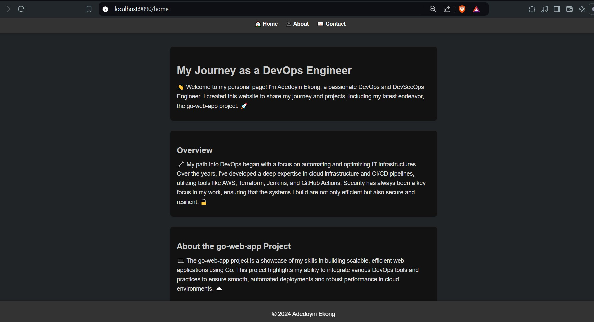
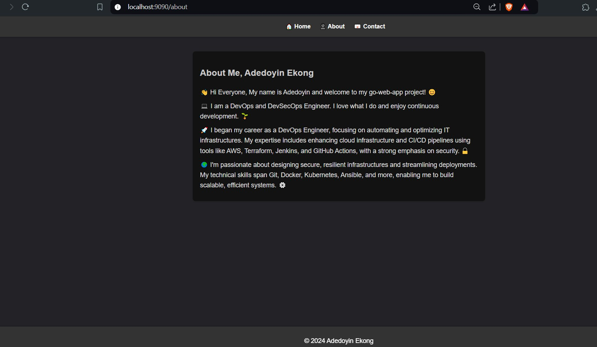
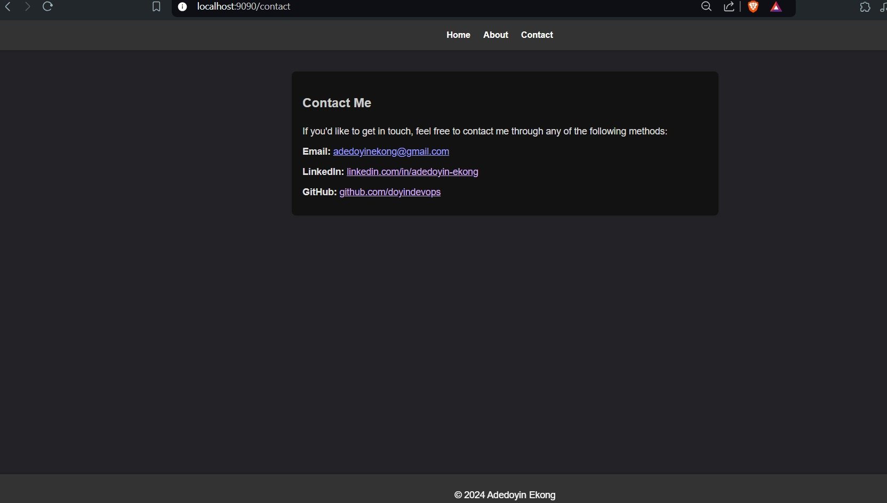

# MY GO-WEB-APPLICATION!

Welcome to the **Go Web Application with DevOps Practices** project! This repository showcases a comprehensive implementation of DevOps best practices for a Go web application. As a passionate DevOps engineer, I aimed to demonstrate a full-fledged CI/CD pipeline, containerization, and automated deployment using industry-standard tools.

## Project Overview

This project centers around a simple Go web application that serves HTTP requests using the `net/http` package. The primary objective was to enhance the application using DevOps methodologies, emphasizing automation, scalability, and security.

### Key Features

1. **Multi-Stage Docker Build**: The Dockerfile employs multi-stage builds to create a lightweight and secure Docker image. This method reduces the image size by only including necessary components, enhancing both performance and security.

2. **Containerization**: The application is containerized using Docker, ensuring consistent operation across different environments. This encapsulation is crucial for reliable deployments, whether locally or in production.

3. **Continuous Integration (CI)**: Implemented using GitHub Actions, the CI pipeline automates the build, test, and integration processes. This automation ensures that code changes are continuously tested, improving overall code quality and accelerating development cycles.

4. **Continuous Deployment (CD)**: Argo CD is used for continuous deployment, allowing seamless updates to the Kubernetes cluster. By adopting a GitOps approach, the desired state of the application is maintained directly from the Git repository, ensuring efficient and error-free deployments.

5. **Kubernetes Deployment**: The deployment strategy utilizes Kubernetes manifests and Helm charts to manage application resources in a Kubernetes cluster. This setup provides scalability and resilience, catering to dynamic workloads and ensuring high availability.

## Go Web Application

This is a simple website written in Golang. It uses the `net/http` package to serve HTTP requests.

### Running the Server

To run the server locally, I executed the following command:

```bash
go run main.go
```

The server will start on port 9090. You can access it by navigating to `http://localhost:9090/home` in your web browser. (Your choice of port is not cast in stone. I used 9090 because I had another application using 8080 on my localhost)

## Getting Started

### Prerequisites

To get started with this project, I made sure that the following tools and platforms were available and accessible :

- **Docker**: Install Docker to build and run containers.
- **Kubernetes Cluster**: A Kubernetes cluster to deploy the application.
- **GitHub**: A GitHub account to clone the repository and set up CI/CD.
- **Docker Hub**: A Docker Hub account to push and pull Docker images.

### Building and Running the Application Locally

Follow these steps to build and run the Go web application locally using Docker:

1. **Clone the repository:**
   ```bash
   git clone https://github.com/doyindevops/go-web-app.git
   cd go-web-app
   ```

2. **Build the Docker image:**
   ```bash
   docker build -t <your-docker-username>/go-web-app .
   ```

3. **Run the Docker container:**
   ```bash
   docker run -p 8080:8080 <your-docker-username>/go-web-app
   ```

### Setting Up Continuous Integration (CI)

The CI pipeline is defined using GitHub Actions. To set up CI for your forked repository:

1. **Fork the repository** on GitHub and clone it to your local machine.
2. **Navigate to the Actions tab** in your GitHub repository.
3. **Enable GitHub Actions** workflows if not already enabled.
4. **Push any code changes** to trigger the CI pipeline, which will build, test, and verify your code automatically.

### Deploying with Continuous Deployment (CD)

For continuous deployment using Argo CD:

1. **Ensure your Kubernetes cluster** is set up with Argo CD. Follow [Argo CD's official documentation](https://argo-cd.readthedocs.io/en/stable/getting_started/) for installation instructions.
2. **Link your GitHub repository** to Argo CD, enabling it to monitor and automatically deploy changes.
3. **Modify the `values.yaml` file** in the Helm chart to suit your deployment needs, then commit and push the changes to GitHub. Argo CD will handle the deployment to the Kubernetes cluster.







